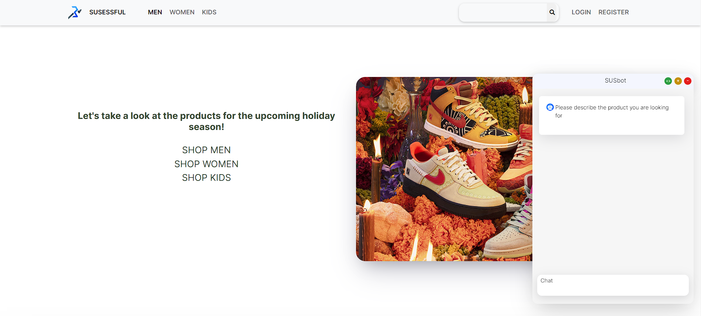

# Ecommerce - Web Application

## Debug on local (very risk)
Simply type below command and Ctrl+C when you want to shut down it.

## Requirements
- Python 3.10.12 with packages in **requirements.txt**:

## Account

- **username:** user
- **pass:** 123456
  

## UI/UX
    

## Summary (Beginning of pitching)

Imagine scrolling online for the perfect shoes, but it's overwhelming. That's where SUSBot comes in – your personal shopping helper. SUSBot is like a smart friend who gets what you want. Chat with it, share your style, and get tailored suggestions for Adidas or Nike shoes instantly, like having a shopping expert 24/7.

Why SUSBot for online shopping? It's about making things easy. No more endless scrolling. SUSBot simplifies it all – ask about sizes or styles, and get quick, accurate info. It's like chatting with a friend. SUSBot makes shopping faster and more fun.

This clever chatbot makes shopping personal and interactive.How? Well, SUSBot's secret weapon is its cutting-edge NLP model, and LLM for answer generation (thanks to OpenAI). This tech wizardry helps SUSBot understand your needs better than ever. It's the key to finding your perfect buy hassle-free. SUSBot makes shopping feel like a friendly chat, guiding you to the best choice effortlessly.
